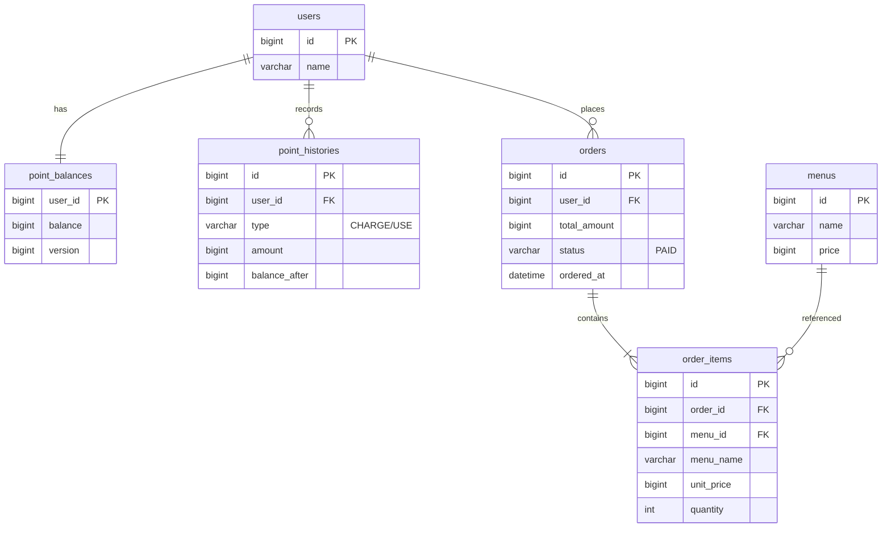

# 커피숍 주문 시스템 (K사 서버 개발 사전과제)

다수 서버·다수 인스턴스 환경에서도 안정적으로 동작하는 커피숍 주문 시스템.
포인트 결제, 주문 내역 실시간 수집, 인기 메뉴 추천을 제공한다.

> 본 문서는 과제 0번 **문제 해결 전략 수립** 산출물이다. 구현 전 설계 점검용으로 작성되었으며,
> 설계 의도와 동시성·일관성·확장성 관점의 선택 근거를 함께 기술한다.

---

## 1. 문제 정의와 핵심 도전 과제

| 필수 API | 핵심 난점 |
| --- | --- |
| 메뉴 목록 조회 | 단순 조회 (읽기 부하 대비 캐시 여지) |
| 포인트 충전 | **동시 충전 시 정합성** (분실 갱신 방지) |
| 주문/결제 | **동시 결제 시 잔액 정합성** + 결제 성공 건만 **실시간 수집(Kafka)** |
| 인기 메뉴(최근 7일) | 집계 **정확성** + 조회 성능 |

도전 요구사항인 **다중 인스턴스 안전성 · 동시성 · 데이터 일관성**은 특히 포인트 충전/차감과
주문 처리에 집중된다. 아래 설계는 이 세 가지를 일관된 원칙으로 관통하도록 구성했다.

---

## 2. 설계 개요 (아키텍처)

```
[Client]
   │  HTTP (REST)
   ▼
[Spring Boot App  × N 인스턴스 (무상태)]
   │              │                       │
   │ 비관적 락     │ Redis 분산락           │ AFTER_COMMIT 발행
   ▼              ▼                       ▼
[ MySQL ]     [ Redis ]              [ Kafka: order-events ] ──▶ [데이터 수집 플랫폼]
 진실의 원천   인스턴스 간 직렬화        결제 완료 이벤트 스트림
```

- **애플리케이션은 무상태(stateless)** — 세션/로컬 상태를 두지 않아 인스턴스를 수평 확장해도 동일 동작.
- **MySQL이 진실의 원천** — 최종 정합성은 DB 트랜잭션 + 행 락으로 보장.
- **Redis 분산락** — 여러 인스턴스에 흩어진 동일 사용자 요청을 애플리케이션 레벨에서 직렬화.
- **Kafka** — 주문 수집을 애플리케이션에서 분리(비동기), 수집 지연이 주문 응답을 막지 않음.

---

## 3. ERD



상세 컬럼·타입·인덱스는 [`docs/db/schema.md`](docs/db/schema.md).

### 주요 설계 결정과 이유

- **포인트 잔액을 `point_balances`로 분리** — 충전/차감 시 잠금 범위를 잔액 행 하나로 최소화.
  `users`에 잔액을 두면 사용자 정보 조회까지 락에 영향받는다.
- **`order_items`에 메뉴명·단가 스냅샷 저장** — 이후 메뉴 가격이 바뀌어도 과거 주문 금액이
  변하지 않도록(불변 이력). 인기 메뉴 집계는 `menu_id` 기준이라 무결성 유지.
- **`point_histories` 이력 테이블** — 잔액의 모든 변화를 추적해 정합성 검증·감사 가능.
- **`orders.ordered_at` 인덱스** — 최근 7일 인기 메뉴 집계의 스캔 범위를 좁힘.

---

## 4. API 명세 (요약)

| # | Method | Path | 설명 |
| --- | --- | --- | --- |
| 1 | GET | `/api/menus` | 커피 메뉴 목록 조회 |
| 2 | POST | `/api/points/charge` | 포인트 충전 (1원=1P) |
| 3 | POST | `/api/orders` | 커피 주문/결제 (포인트 차감 + Kafka 발행) |
| 4 | GET | `/api/menus/popular` | 최근 7일 인기 메뉴 3개 |

에러 응답 형식은 `{ "code": "...", "message": "..." }` 로 통일.
주요 코드: `USER_NOT_FOUND`(404), `MENU_NOT_FOUND`(404), `INSUFFICIENT_POINT`(409),
`INVALID_AMOUNT`(400), `VALIDATION_ERROR`(400), `CONCURRENCY_CONFLICT`(409).

요청/응답 예시는 [`docs/api/`](docs/api/) (menu / point / order).

---

## 5. 문제 해결 전략

> **필수 vs 도전 분리.** 아래 전략(5.1~5.4)은 과제의 **도전 요구사항**(다수 인스턴스·동시성·
> 데이터 일관성·테스트)에 해당한다. 구현은 먼저 **필수 요구사항**(메뉴·충전·주문/결제·Kafka
> 전송·인기메뉴)을 단일 트랜잭션 기반으로 동작시킨 뒤, 아래 전략을 **별도 도전 레이어(백로그
> E6)** 로 얹는 순서로 진행한다. 백로그: [`docs/design/jira-backlog.md`](docs/design/jira-backlog.md).

### 5.1 동시성 — 포인트 충전/차감  *(도전 ②)*

포인트는 **분실 갱신(lost update)** 이 가장 치명적인 지점이다(예: 잔액 1만 원에서 동시에
5천 원 결제 2건이 모두 성공하면 안 됨). 두 겹으로 방어한다.

1. **DB 비관적 락 (최종 방어선)** — 잔액 변경 시 `SELECT ... FOR UPDATE`로 잔액 행을 잠근다.
   같은 사용자의 동시 트랜잭션은 DB 레벨에서 순차 처리되어 정합성이 보장된다.
2. **Redis 분산락 (경합 완화)** — 여러 인스턴스에 도착한 동일 사용자 요청을 `point:{userId}`
   키로 직렬화. DB 락 대기·데드락 가능성을 애플리케이션 레벨에서 미리 줄인다.

> **왜 비관적 락을 1차 선택했나?** 포인트 결제는 충돌(경합) 빈도가 낮지 않고, 충돌 시
> "재시도"보다 "대기 후 정확히 처리"가 사용자 경험·정합성에 유리하다. 낙관적 락(@Version)은
> 충돌이 드문 읽기 위주에 적합하나, 결제처럼 충돌이 잦으면 재시도 폭증 위험이 있어 보조로만 둔다.
> `version` 컬럼은 유지해 방어적 낙관적 락으로 병행 가능하게 했다.

### 5.2 데이터 일관성 — 결제와 이벤트 발행  *(도전 ③)*

- 포인트 차감 + 주문/항목 저장은 **하나의 트랜잭션**. 하나라도 실패하면 전부 롤백.
- Kafka 발행은 **트랜잭션 커밋 이후**(`@TransactionalEventListener(AFTER_COMMIT)`)에 수행 →
  결제가 실제로 성공한 주문만 수집 플랫폼으로 전송(결제 실패 건 오전송 방지).
- **이중 쓰기(dual write) 문제** 강화 옵션: 커밋 직후 발행도 앱 다운 시 유실 가능하므로,
  운영 신뢰성이 중요하면 **Transactional Outbox 패턴**(아웃박스 테이블에 함께 커밋 → 릴레이가
  Kafka로 발행)으로 확장한다. 과제에서는 AFTER_COMMIT 발행을 기본으로 하고 Outbox를 확장안으로 명시.

### 5.3 다중 인스턴스 / 확장성  *(도전 ①)*

- **무상태 애플리케이션** — 로컬 캐시·세션 없음. 로드밸런서 뒤에 인스턴스를 늘리면 그대로 확장.
- **상태는 외부 저장소로** — 잔액/주문은 MySQL, 분산락은 Redis, 수집 스트림은 Kafka.
- **읽기 확장 여지** — 메뉴 목록·인기 메뉴는 변경 빈도가 낮아 Redis 캐시(TTL) 적용 가능.
  인기 메뉴는 매 조회 집계 대신 주기적 집계 결과를 캐시하면 조회 부하를 낮출 수 있다(확장안).

### 5.4 인기 메뉴 정확성

- 결제 완료(`status=PAID`) 주문만, `ordered_at >= now-7일` 범위에서 `order_items.quantity` 합으로 집계.
- 동점은 `menu_id` 오름차순 안정 정렬로 결정적 결과 보장.
- 정확성 우선 설계(실시간 집계 쿼리). 트래픽 증가 시 집계 테이블/캐시로 성능 최적화(확장안).

---

## 6. 기술 선택 이유

| 선택 | 이유 | 대안과 트레이드오프 |
| --- | --- | --- |
| **Spring Boot / Java 17** | 표준적 서버 스택, 트랜잭션·검증·테스트 생태계 성숙 | — |
| **MySQL (운영) + H2 (테스트)** | 운영은 검증된 RDBMS, 테스트는 DB 구동 없이 빠른 슬라이스/통합 | H2만: 설득력↓ / MySQL만: 테스트 무거움 |
| **비관적 락 + Redis 분산락** | 결제 정합성 확실 + 다중 인스턴스 직렬화 | 낙관적 락: 충돌 잦으면 재시도 비용 |
| **Kafka** | 수집을 비동기 분리, 수집 지연이 주문 응답을 막지 않음, 스트리밍 확장 용이 | 동기 HTTP 전송: 결합↑·지연↑ |
| **Outbox(확장안)** | 이벤트 유실 방지(정확히 한 번에 근접) | 구현 복잡도↑ (과제에선 옵션) |

---

## 7. 실행 방법 (구현 단계 예정)

> 현재 리포지토리는 설계(0번)와 하네스 환경까지 구성된 상태다. 아래는 구현 완료 후 기준.

```bash
# 의존성(구현 시 추가): spring-boot-starter-web, -data-jpa, -validation,
#   -data-redis, spring-kafka, mysql-connector-j, (test) h2
./gradlew build
./gradlew test          # 동시성/일관성 테스트 포함
./gradlew bootRun
```

로컬 인프라는 `docker-compose`(MySQL·Redis·Kafka)로 제공 예정.

### 7.1 실행 전제조건 / 검증 절차

- **빌드**: `./gradlew clean build` — 인프라(DB 등) 없이 성공해야 한다. 테스트는 H2(`test`
  프로파일, `src/test/resources/application-test.yml`)로 동작하므로 MySQL이 없어도 통과한다.
- **`./gradlew bootRun` (프로파일 미지정)**: `application.yml`의 `spring.profiles.default: dev`
  에 의해 **dev 프로파일로 폴백**한다. dev는 MySQL을 사용하므로(`application-dev.yml`) 아래가
  준비돼 있어야 정상 기동한다.
  - 로컬 3306에 MySQL 구동
  - `coffee_order` 데이터베이스 존재
  - `coffee`/`coffee`(기본값, `DB_USERNAME`/`DB_PASSWORD` 환경변수로 오버라이드 가능) 계정과
    해당 DB에 대한 접근 권한
  - 위 조건 미충족 시 `Access denied for user 'coffee'@'localhost'` 또는 커넥션 실패로
    기동이 실패한다 — **이는 환경 미준비이며 코드 결함이 아니다.**
- **주의**: `./gradlew bootRun --args='--spring.profiles.active=test'`로 test 프로파일을 강제해
  H2로 우회 기동하는 것은 **불가**하다. H2는 `testRuntimeOnly` 의존성이라 `bootRun`의 런타임
  클래스패스에 없다(`Failed to determine a suitable driver class` 에러 발생). test 프로파일은
  테스트 실행(`@ActiveProfiles("test")`) 전용이다.
- **판별 기준**: L1(필수) — `./gradlew test`의 `contextLoads`가 통과하면 H2 기준 애플리케이션
  컨텍스트(JPA/Kafka/validation 포함) 기동은 검증된 것으로 간주한다. L2(조건부) — 위 MySQL
  전제조건이 갖춰진 환경에서만 `./gradlew bootRun`으로 dev 기동을 추가 확인한다.

---

## 8. 테스트 전략 (도전 요구사항 4)

- **단위**: 서비스 로직(Mockito) — 잔액 부족·정상 차감·충전 규칙.
- **동시성**: `ExecutorService`로 동일 사용자에 대해 동시 충전/결제 N건 → 최종 잔액·이력 합이
  정확한지 검증(분실 갱신 없음). 재고성 자원 없이 포인트 정합성에 집중.
- **슬라이스**: 컨트롤러(`@WebMvcTest`) — 상태 코드·검증·에러 코드 계약.
- **통합**: `@SpringBootTest` + Testcontainers(MySQL/Redis/Kafka) 또는 임베디드 대체.
- **이벤트**: 결제 성공 시에만 `order-events` 발행되는지, 실패(롤백) 시 미발행 검증.

---

## 부록. 개발 하네스

본 프로젝트는 Plan→Generate→Evaluate 기반 개발 하네스 위에서 진행한다.
작업 규칙은 [`AGENTS.md`](AGENTS.md) → [`docs/`](docs/) 를 진입점으로 한다.
구현 백로그(에픽/스토리/태스크)는 [`docs/design/jira-backlog.md`](docs/design/jira-backlog.md).
